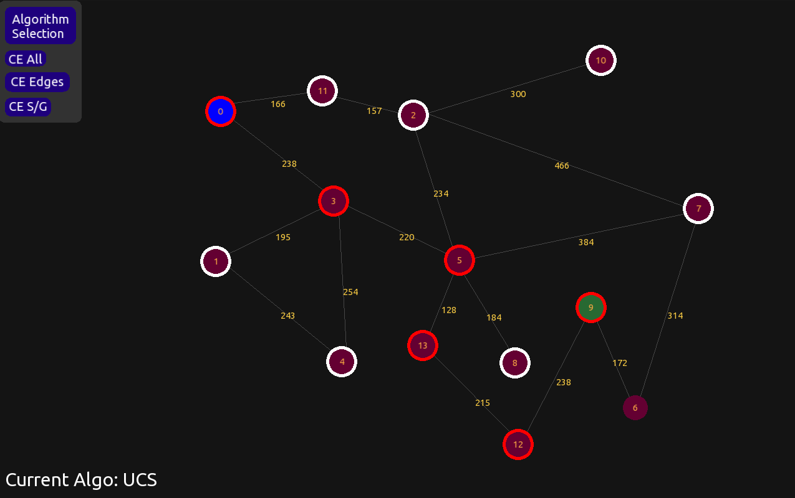
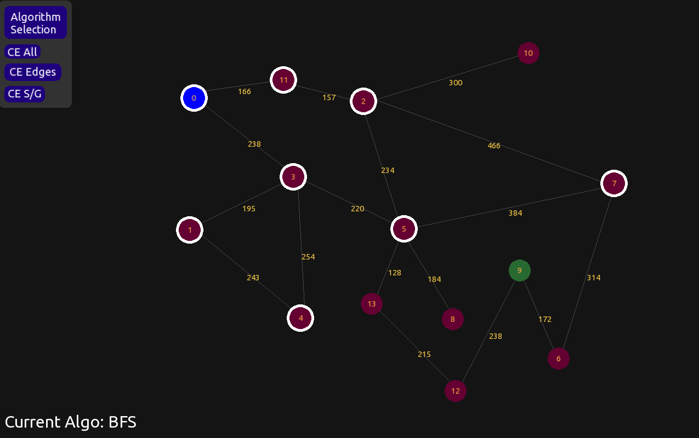
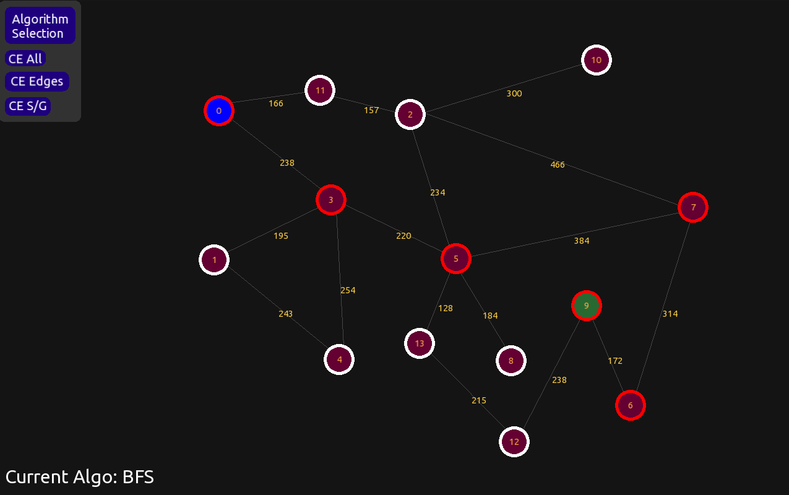

# graph_search_viz



Visualizations of graph search algorithms such as:

Non-Weighted
- BFS
- DFS
- IDS

Weighted
- UCS
- GREEDY
- A*

Built using SFML
```
sudo apt install libsfml-dev
```

Compile & Run
```
make
make run
make clean
```

Usage
- Place nodes using left mouse button
- Create edges between nodes using right mouse button
- Edge weights are set automatically using edge length
- Assign nodes as start/goal using spacebar (start placed first)
- Run selected search algorithm using enter
- Change algorithm/clear nodes/edges using sidebar buttons





